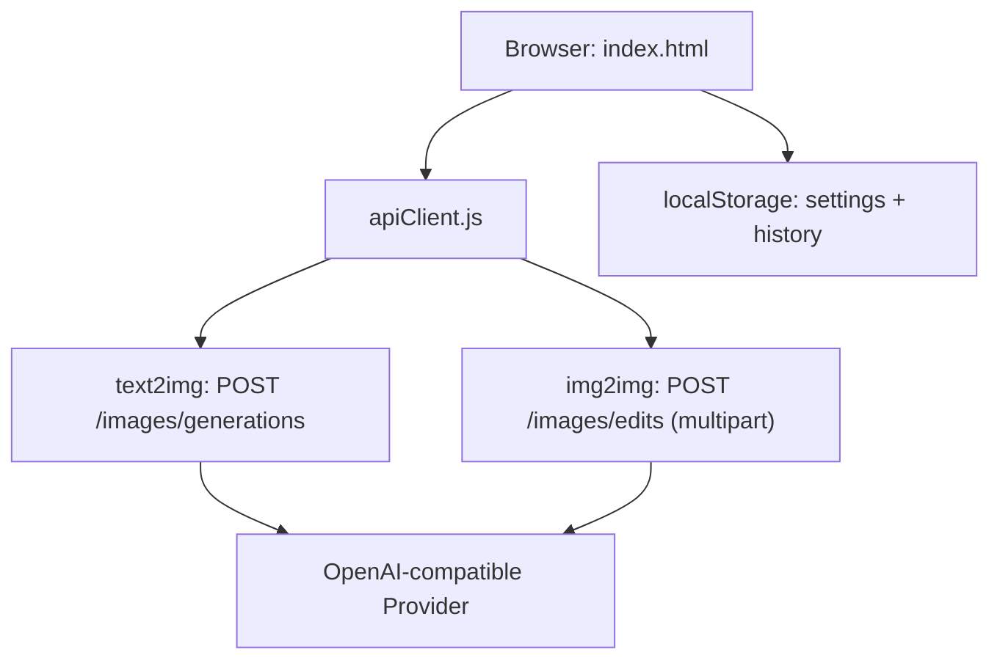

# 神笔马良文生图工具 技术设计

Feature Name: magic-brush-text2image
Updated: 2026-08-12

## Description

一个自包含的单页 Web 应用，提供文生图与图生图能力。页面通过浏览器直接调用用户配置的 OpenAI 兼容文生图 API，无构建步骤、无后端依赖，可用任意静态服务器托管。

## Architecture



架构说明：

- **单页静态应用**：`index.html` + `styles.css` + `app.js`，无框架、无构建。
- **API 客户端**（`apiClient.js` 模块）：封装请求构造、图片结果归一化（URL 或 `b64_json`）、错误解析。
- **配置与历史**：全部保存在 `localStorage`，无需后端存储。
- **直连模式**：浏览器直接请求配置的 API 地址。若目标服务不支持 CORS，页面提供明确的错误提示与建议。

## Components and Interfaces

### UI 组件

| 组件 | 职责 |
|------|------|
| 提示词输入区 | 多行文本输入，支持风格参考占位文案 |
| 参数面板 | 尺寸（如 1024x1024、1024x768）、数量 n（1-4）、风格等扩展参数 |
| 模式切换 | 文生图 / 图生图（上传参考图） |
| 结果区 | 图片网格、大图预览、单张下载 |
| 历史侧栏 | 按时间倒序展示生成记录，点击回看 |
| 设置弹窗 | 配置 baseURL、API Key、model，存入 localStorage |

### apiClient 接口

| 方法 | 说明 |
|------|------|
| `generate({ baseURL, apiKey, model, prompt, n, size, extra, refImage })` | 根据是否含参考图选择图生图或文生图接口，返回归一化图片结果数组 |
| `normalizeResults(data)` | 将 OpenAI 兼容响应 `{ data: [{ url } or { b64_json }] }` 归一化为图片数组 |
| `fetchAsBlob(url)` | 下载远程图片用于本地保存（处理跨域时降级） |

### 请求格式

文生图（JSON）：

```json
POST {baseURL}/images/generations
{
  "model": "gpt-image-1",
  "prompt": "一只飞行的龙，水墨风格",
  "n": 2,
  "size": "1024x1024"
}
```

图生图（multipart/form-data）：

```
POST {baseURL}/images/edits
model=<model>
prompt=<prompt>
n=<n>
size=<size>
image=<file>
```

## Data Models

### 设置（localStorage key: `mb.settings`）

```json
{
  "baseURL": "https://api.openai.com/v1",
  "apiKey": "",
  "model": "gpt-image-1",
  "defaultSize": "1024x1024"
}
```

### 历史记录（localStorage key: `mb.history`）

```json
{
  "records": [
    {
      "id": "uuid",
      "ts": 1723449600000,
      "prompt": "一只飞行的龙，水墨风格",
      "mode": "text2img",
      "params": { "n": 2, "size": "1024x1024", "model": "gpt-image-1" },
      "images": ["data:image/png;base64,..."]
    }
  ]
}
```

## Correctness Properties

1. 提示词为空时不发起请求。
2. 请求期间生成按钮禁用，防止重复提交。
3. 历史记录以 `dataURL` 存储时受容量约束：单记录图片数为 `n`，总记录上限为 50，超出时删除最旧记录。
4. 设置中 `apiKey` 不写入代码仓库，仅保存在浏览器 localStorage。
5. 归一化结果优先使用 `url`，无 `url` 时使用 `b64_json`。

## Error Handling

| 场景 | 处理 |
|------|------|
| 未配置 API Key / baseURL | 弹出设置面板并提示 |
| HTTP 401/403 | 提示鉴权失败，引导检查 API Key |
| HTTP 429 | 提示触发限流，稍后重试 |
| 网络错误 / CORS | 展示错误码，提示检查接口地址、CORS 配置或使用支持跨域的网关 |
| 响应无 `data` | 解析错误消息字段（`error.message`）展示 |

## Test Strategy

- 手工验证流程：配置 → 文生图 → 多图 → 下载 → 历史回看 → 图生图 → 错误提示。
- 单元层面：`normalizeResults` 支持 `url`、`b64_json`、混合三种输入。
- 使用本地 `python3 -m http.server` 启动静态服务验证页面功能。
