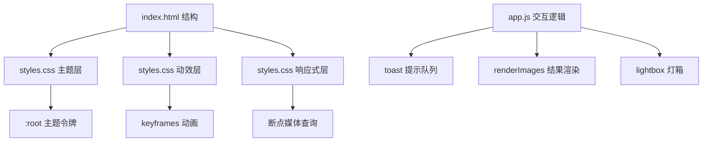

# 页面布局与 UI 优化

Feature Name: ui-optimization
Updated: 2026-08-12

## Description

对神笔马良文生图工具进行纯前端视觉与体验优化，范围限定为：视觉主题精修、交互动效增强、窄屏响应式适配。保持「左侧 320px 控制面板 + 右侧结果/历史」两列布局不变，不改动数据模型与后端接口。实现集中在 `web/styles.css`，辅以 `web/app.js` 的少量动效与提示逻辑调整。

## Architecture

现状与目标对照：

| 层 | 现状 | 目标 |
|---|---|---|
| 主题 | 已有 `:root` 变量（styles.css#L1-13） | 补齐字体层级、统一取色入口 |
| 动效 | hover transition、毛笔加载动画 | 增加结果淡入、弹窗过渡、toast 动画与队列 |
| 响应式 | 仅 `@media (max-width: 720px)`（styles.css#L122） | 增加 1100px 断点，细化 721-1099px 中间态 |
| 反馈 | toast 单例（app.js#L105-110） | 增加顺序展示队列，避免多提示重叠 |

## Components and Interfaces

### styles.css（主实现载体）

- **`:root` 主题令牌**：`--ink/--muted/--card/--line/--accent/--gold/--err/--radius/--shadow` 已存在（styles.css#L1-13）。新增字体令牌 `--font-ui`、`--font-title` 与标题字号层级。
- **动效关键帧**：保留 `ink-draw`/`pen-travel`（styles.css#L473-490）；新增 `fade-up`（结果卡片淡入上移）、`toast-in`（提示滑入）、`zoom-in`（灯箱/面板过渡）。
- **断点媒体查询**：
  - `>= 1100px`：两列 `320px 1fr`（当前默认，styles.css#L112-120）
  - `721px - 1099px`：收紧 `gap`、结果网格最小列宽降至 150px
  - `<= 720px`：单列堆叠，控制面板置顶（现样式扩展），可点击区域不小于 44px
- **空状态**：复用 `.empty-state`（styles.css#L382-395），统一毛笔主题插图配色。

### app.js（交互逻辑）

- **`showToast`（app.js#L105-110）**：单例改为队列；插入动画类后于定时器清除。
- **`renderImages`（app.js#L204-266）**：卡片挂载时添加 `fade-up` 动画类，于 `onload` 后移除 `loading-mask`。
- **灯箱（app.js#L283-352）**：`openLightbox`/`closeLightbox` 增加过渡类切换。

### index.html

- 结构保持不变；如需 toast 容器（`#toast`）与空状态元素已存在则复用，不新增嵌套层级。

## Data Models

无新增持久化数据。本特性涉及的静态结构：

- 主题令牌表：`{ color, radius, shadow, fontScale }`，全部定义于 CSS，无运行时数据。
- 断点常量：`1100px`（两列）、`720px`（单列）。
- toast 队列：内存数组 `pendingToasts: string[]`，单条展示时长 3000ms。

## Correctness Properties

1. 任意视口宽度下，页面不发生横向溢出滚动（根布局 `max-width: 1440px` 保持）。
2. 断点判定互斥：`> 720px` 与 `<= 720px` 两态不重叠。
3. 动效仅作用于 `transform`/`opacity` 属性，不触发重排，不阻塞表单输入。
4. 结果网格任意列数下，卡片宽高比与间距一致。
5. 灯箱在任何断点下均提供缩放、下载与关闭能力。
6. 历史条目任意尺寸/风格组合下，meta 行以省略号截断而不撑破卡片。

## Error Handling

1. 多提示重叠：toast 队列顺序消费，前一条消退后再展示下一条。
2. 图片加载失败：`img.onerror` 隐藏失败卡片（app.js#L253-256），其余卡片正常展示。
3. 动效兼容：低能力环境（`prefers-reduced-motion`）下动画时长降为零，功能不受影响。
4. 空态兜底：结果区与历史区各自维护空状态展示，无数据时不渲染占位内容。

## Test Strategy

采用 Playwright 无头浏览器验证，脚本置于 `/tmp/opencode/`：

1. **断点测试**：`viewport 1440x900 / 900x900 / 375x812` 三档，断言 `.layout` 计算列数分别为两列、两列（收紧）、单列，且无横向滚动。
2. **动效存在性测试**：断言结果卡片在挂载后 50ms 内带 `fade-up` 动画类；toast 展示后 3 秒内消失。
3. **toast 队列测试**：连续触发两次 `showToast`，断言第二条在第一条消退后才可见。
4. **点击目标测试**：窄屏（375px）下枚举主要可交互元素，断言 `getBoundingClientRect` 高度不小于 44px。
5. **灯箱回归**：100% 无滑块、放大出现滚动、下载按钮可用（沿用既有验证脚本）。
6. **视觉回归**：三个断点各截图一张，人工核对无错位、无重叠。

## References

[^1]: (styles.css#L1-L13) - [:root 主题令牌定义](web/styles.css)
[^2]: (styles.css#L112-L132) - [两列布局与面板样式](web/styles.css)
[^3]: (styles.css#L473-L490) - [毛笔加载动画关键帧](web/styles.css)
[^4]: (styles.css#L382-395) - [空状态样式](web/styles.css)
[^5]: (app.js#L105-L110) - [toast 单例实现](web/app.js)
[^6]: (app.js#L204-L266) - [结果卡片渲染](web/app.js)
[^7]: (app.js#L283-L352) - [灯箱打开/关闭逻辑](web/app.js)
